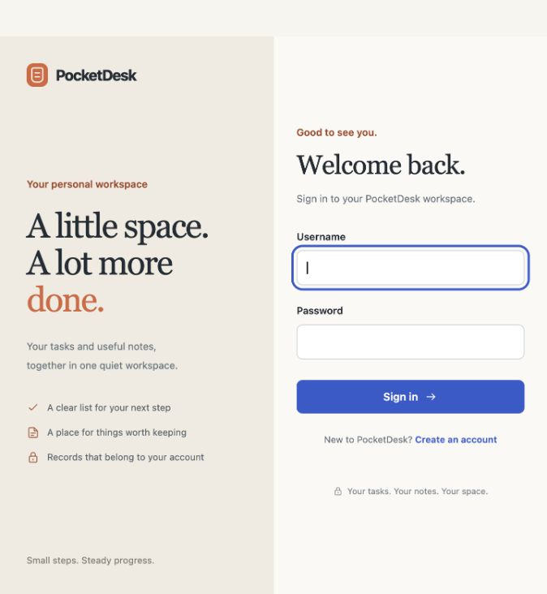
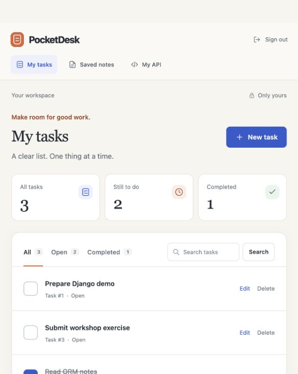
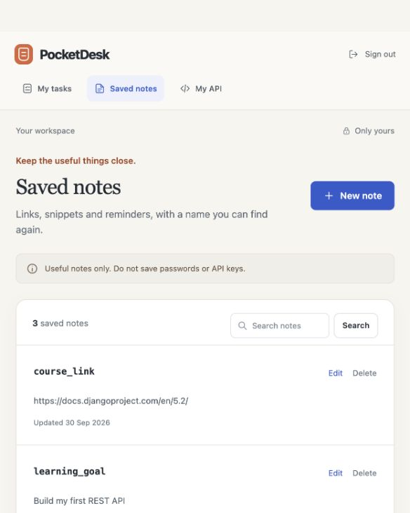
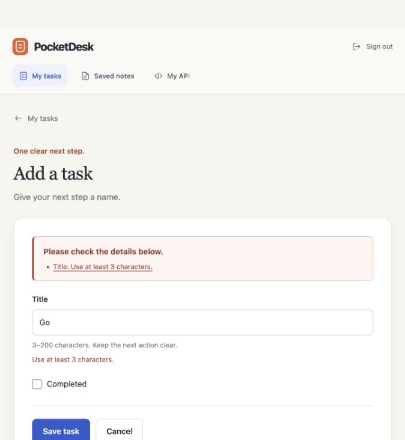
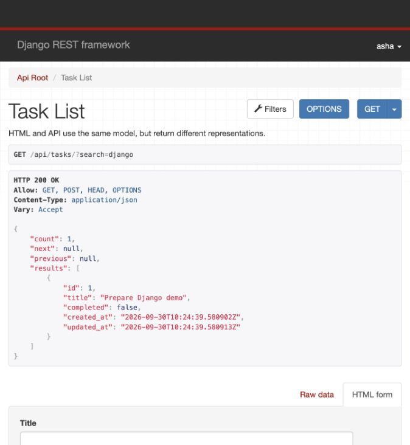

# PocketDesk

A complete Django companion to **Beyond Web Page: Build Modern Web Application with Django**.

PocketDesk is a personal TODO list and a store for useful key-value notes. The browser and REST API use the same database and the same ownership rules. This repository contains application code, migrations, tests, deployment configuration, real application screenshots, and teaching notes.

**Deployment status:** prepared for Vercel, not deployed to a public account. You must connect your own PostgreSQL database and set production secrets. Do not use this app as a password manager: note values are ordinary database text, not end-to-end encrypted secrets.

## What you can do

- Register locally, sign in, and sign out securely.
- Create, edit, complete, search, filter, and delete your own tasks.
- Save a named note such as `course_link` and retrieve it through REST.
- Use the browser or a private API token. Other accounts cannot access your records.
- Inspect Django admin, the browsable API, validation errors, and persistent database records.

## Screenshots of the running application

These images show the local Django application with fictional demo data, not design mockups or a deployed Vercel environment.

### Login



### Personal tasks



### Saved key-value notes



### Validation and the REST API





## 1. Run locally

Prerequisites: **Python 3.13** and a terminal. No Node.js build step is required for the app. Vercel CLI commands later require a supported Node.js installation.

Open a terminal in this `pocketdesk` directory, the directory containing `manage.py`:

```bash
python3.13 -m venv .venv
source .venv/bin/activate
python -m pip install --upgrade pip
python -m pip install -r requirements-dev.txt
python scripts/init_local.py
python manage.py migrate
python manage.py runserver
```

On Windows PowerShell, use `py -3.13 -m venv .venv` and `.venv\Scripts\Activate.ps1`. After activating the environment, the remaining `python` commands are the same. The initializer generates a private random local signing key without printing it and never replaces an existing `.env`. If you copy `.env.example` manually instead, replace its secret-key placeholder before running Django.

Open [http://127.0.0.1:8000/](http://127.0.0.1:8000/). Use **Create account**, then sign in. Your first workspace will be empty. SQLite creates a local `db.sqlite3` file when you run migrations. This file is ignored by Git.

Stop the development server with **Ctrl+C**. `runserver` is a development tool, not the production server.

### Optional demo records

The demo seeder runs only with `DEBUG=True`. Supply a password for a new fictional local account through `DEMO_PASSWORD`, rather than committing one, then run `python manage.py seed_demo --username asha`. See `python manage.py seed_demo --help` for the supported options. It preserves existing records and will not change an existing account's password. Do not seed demo users into production.

### Optional administrator

```bash
python manage.py createsuperuser
```

Visit [http://127.0.0.1:8000/admin/](http://127.0.0.1:8000/admin/). An administrator can inspect all users' records by design. Do not grant staff or superuser access to ordinary users.

## 2. Understand the project

```text
pocketdesk/
├── manage.py                 # Local Django management entry point
├── config/                   # Settings, root routes, WSGI, health and middleware
├── accounts/                 # Signup and account-related behavior
├── tasks/                    # TODO models, forms, views, API and tests
│   ├── models.py             # Database fields and model validation
│   ├── forms.py              # Browser input contract
│   ├── views.py              # HTML request handling and owner lookups
│   ├── serializers.py        # JSON input/output contract
│   ├── api.py                # REST ViewSet
│   ├── urls.py               # HTML routes
│   ├── migrations/           # Version-controlled database changes
│   └── tests.py              # Repeatable behavior/security tests
├── entries/                  # Key-value notes with the same layered structure
├── templates/                # Shared layout, login, task and note pages
├── static/                   # Local CSS/JavaScript; no frontend build required
├── scripts/                  # Safe local environment initialization
├── docs/                     # API, deployment, architecture, screenshots
├── .env.example              # Documented local settings, never real secrets
├── .python-version           # Vercel Python runtime selection
├── pyproject.toml            # Project/tool configuration
├── requirements.txt          # Pinned runtime packages
├── requirements-dev.txt      # Runtime packages plus local test tools
└── vercel.json               # Vercel project configuration
```

The presentation uses small excerpts to teach one concept at a time. The repository is the integrated, runnable version. It deliberately puts notes in a separate `entries` app, includes timestamps, implements the actual notes UI, and adds deployment/security safeguards. The presentation's implementation appendix explains these differences.

Read [Architecture and request lifecycle](docs/ARCHITECTURE.md) and [Presentation-to-code map](docs/TEACHING_MAP.md).

## 3. Call the REST API

Browser clients use Django sessions. Sign in and open `/api/` for the browsable API. Unsafe session requests need CSRF protection. External clients use `Authorization: Token …` over HTTPS.

Create an API token for an existing local user:

```bash
python manage.py drf_create_token asha
```

The command prints a secret. Store it privately, never in Git, screenshots, slide notes, exported Postman collections, or shared terminal logs. Production tokens belong to production users and do not transfer from SQLite.

For a local test, set `POCKETDESK_TOKEN` in your shell to your private token. Do not paste it into a saved script. The placeholder below is intentionally not usable:

```bash
export POCKETDESK_TOKEN='<your-private-local-token>'
curl --fail-with-body http://127.0.0.1:8000/api/tasks/ \
  -H "Authorization: Token ${POCKETDESK_TOKEN}"

curl --fail-with-body http://127.0.0.1:8000/api/entries/ \
  -H "Authorization: Token ${POCKETDESK_TOKEN}" \
  -H 'Content-Type: application/json' \
  -d '{"key":"course_link","value":"https://docs.djangoproject.com/en/5.2/"}'

curl --fail-with-body 'http://127.0.0.1:8000/api/entries/by-key/?key=course_link' \
  -H "Authorization: Token ${POCKETDESK_TOKEN}"
```

Use your `https://…vercel.app` origin instead of localhost after deployment. The database assigns record IDs, so never assume a created row has ID `1`.

The complete route matrix, request/response examples, pagination, token rotation, and Postman instructions are in [API guide](docs/API.md).

## 4. Run the checks

```bash
python manage.py check
python manage.py makemigrations --check --dry-run
python manage.py test --settings=config.test_settings
ruff check .
```

Tests cover validation, authentication, ownership, HTML/REST writes, CSRF-sensitive behavior, and configuration. Tests create a separate test database, not your normal local data. SQLite tests do not replace a staging PostgreSQL smoke test. See [Verification and release checklist](docs/VERIFICATION.md).

## 5. Deploy to Vercel

Use [the complete Vercel deployment guide](docs/VERCEL.md). The short version:

1. Put this project in a private Git repository or use the Vercel CLI locally.
2. Select the directory that contains `manage.py` as the Vercel **Root Directory**. In this workspace that directory is `pocketdesk`.
3. Connect an external PostgreSQL database and set the documented environment variables separately for Preview and Production.
4. Run migrations deliberately against the intended database before sending traffic to a release that needs the schema. Do not migrate on every request or every preview build.
5. Deploy, create an intended account, and test login, private CRUD, REST, static files, and data persistence.

Vercel detects Django through `manage.py` and its WSGI configuration. It collects static files when `STATIC_ROOT` is configured. See [Vercel's Django documentation](https://vercel.com/docs/frameworks/full-stack/django). The instructions in this repository were checked on 30 September 2026.

No account, database, domain, paid service, or public deployment is automatically created by this project.

## Security boundaries

- Every normal HTML/API query starts with `owner=request.user`. Client-supplied owners cannot transfer records.
- Passwords use Django's password hashing. Sessions stay in the database. Logout and HTML mutations use POST; REST writes use POST/PUT/PATCH/DELETE.
- HTML output is escaped and queries use Django's ORM. CSRF protection remains enabled.
- Production refuses incomplete configuration and requires PostgreSQL with SSL.
- Signup is a local learning convenience and is disabled by default in production.
- Database-backed login protection works across multiple application instances. Production traffic controls and monitoring still need configuration.
- DRF's simple tokens do not expire automatically. Revoke/rotate them, and choose an expiring identity scheme before a broader client rollout.
- Administrators and your database provider can access stored note values. Do not store passwords, API keys, financial information, or other sensitive data in demo notes.

See [Security and operational limitations](docs/VERCEL.md#security-and-operational-limitations) before public use.

## Teaching material

[Updated presentation with live implementation appendix](docs/presentation/Beyond_Web_Page_Django_Live_Project.pptx)

The original workshop flow covers Python, Django MTV/MVT, ORM, forms, auth, REST, Git, and deployment. The appended implementation guide covers this repository and includes screenshots captured from the running app.

